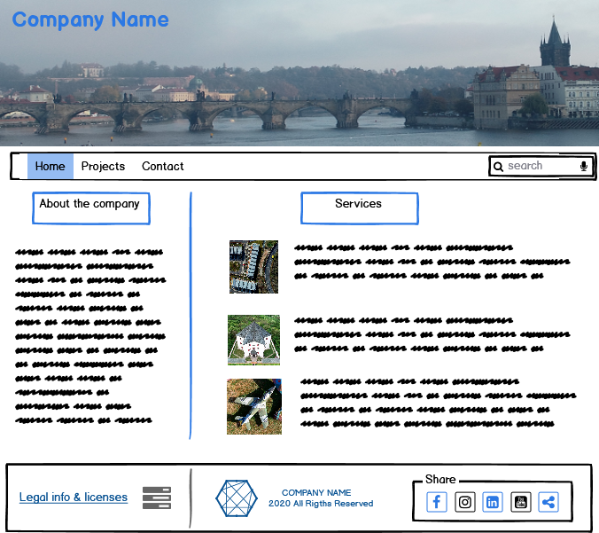
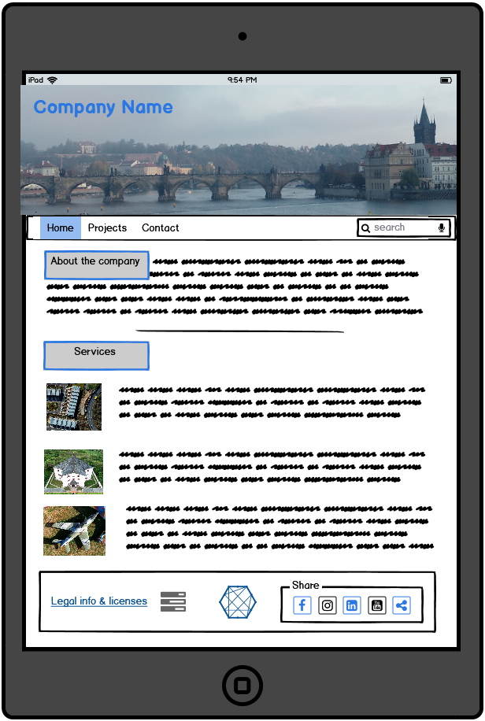
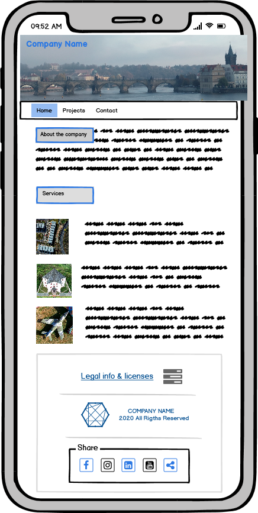

# User Centric Frontend Project

         
## Website for a company providing aerial photo/video services

[Github Pages link](https://olekst.github.io/User-Centric-Frontend-Milestone-Project-1/)

The project is a website for a company providing services in aerial photography & filming on the terrtory of the Czech Republic. 
The website provides info about the company, equipment it uses for its proejcts, a list of services it provides, also showcases some projects
and photo gallery. There is a contact page with address of the company, a Google map with its locations, and a contact form which enables visitors to contact the company.
The footer contains a link to the license from the Civil Aviation Authority, and links to social media sites.

The business goals of this website are:

* Create online presence, and provide info abut the company, its services.

* Present examples of projects, types and quality of photos, & demonstrate company's expereince.

* Offer a simple way to find the company's location and contact it via the contact-form or a phone. 

The customer goals of this website are:

* Searching for a company providing aerial photo/vidoe services with suitable experience and capabilities.

* Access to the company's portfolio of services & implemented projects.

* Clear info about license/permit to provide the offered services. 

* Easy and clear means of contacting the company.

## Wireframes

Balsamiq wireframes software was used to create wireframes for this proejct.
PDF and BMPR files are stored at /assets/wireframes.

<table>
    <tr>
        <td></td>
        <td></td>
        <td></td>
    </tr>
</table>

You can see all the other wireframes here:
 (Computer-, Pad-, phone-view) in the [wireframes folder](https://github.com/OlekSt/User-Centric-Frontend-Milestone-Project-1/tree/master/assets/wireframes/thumbnails)
[Projects Page](https://github.com/OlekSt/User-Centric-Frontend-Milestone-Project-1/blob/master/assets/wireframes/thumbnails/projects.png)
[Projects-Pad](https://github.com/OlekSt/User-Centric-Frontend-Milestone-Project-1/blob/master/assets/wireframes/thumbnails/projects_pad.png)
[Projects-Phone](https://github.com/OlekSt/User-Centric-Frontend-Milestone-Project-1/blob/master/assets/wireframes/thumbnails/projects_phone.png)
[Contact Page](https://github.com/OlekSt/User-Centric-Frontend-Milestone-Project-1/blob/master/assets/wireframes/thumbnails/contact.png)
[Contact-Pad](https://github.com/OlekSt/User-Centric-Frontend-Milestone-Project-1/blob/master/assets/wireframes/thumbnails/contact_pad.png)
[Contact-Phone](https://github.com/OlekSt/User-Centric-Frontend-Milestone-Project-1/blob/master/assets/wireframes/thumbnails/contact_phone.png)

## UX & User Stories

The purpose of the site is to provide a simple, easy to use format presenting information the company, services it offers, and its expereince by presenting implemented projects, and present its photo portfolio. It is aimed at potential private and business clients from various industries, inluding (but not limited to) real estate, sport & cultural events, tourism & travel, industrial complexes & construction, etc. 
The target visitor is English & Czech speaking. 

1. First visitor is welcomed by a great view of the main landmark of Prague - The Charlse bridge, from an unusual viewpoint. This shows a visitor what great and unorthodox image can be captrued from any point in the air around the point of interest.  
2. Right underneath the main image a potential client gets directly to info about the company, and its services. The services area features more aerial images of Czech landmarks and industrial buildings.
3. A new visitor can easily & intuitively navigate between the pages, so I don’t waste time searching for things. The main menu is clearly presented on the main/hero image and a visitor won't get confused with how to navigate the site. 
4. A visitor can access immediately the list and descriptioin of provided services, used equipment, and featured implemented projects, featuring impressive photos. For enhanced impression the section featuring the projects is complemented by a gallery of best aerial photos. 
5. All the pages provide easy access to social media (instagram and facebook), which contain more photos and videos produced by the company.
6. A potential client can see what type of projects the company implmeneted, and get a clear idea of its experience. 
7. Any potential client or a business with time constraints can use the contact form quickly & intuitively to get more info or discuss cooperation.

## Features

The website has three pages (Home, Projects, and Contact). Each page has a responsive navigation bar, a logo in the top left-hand corner and a footer that has license & copyright information, plus links to social media - Facebook, Instagram, LinkedIn. 

The website's objective is to maximise the amount of exposure of the user to the aerial photographs, so all the pages have the  hero image (responsive to attract attention)depicting an appealing aerial view of the touristic and historical landmark of Prague - the Charles bridge. A user will see the hero image evvery time switches between pages. Plus Services, Projects and Gallery contain a lot of high quality aerial phtotos to create a deep impression in a visitor.

### Home

The Home page has a a responsive hero image to create attention-grabbing experience for the user. Responsive menu is placed in the right-bottom corner of the hero image on the dark background of the Vltava river. It is easily visble for users to see it right away. The menu icons react to mouse movement so that a visitor can easily navigation between pages. 

Below the hero image the page is split into 1/3-2/3, where left side provide descriptive info about the copmany and the equipment it uses for its projects. The right side gives a list of services the copmany provides with appealing aerial photoes and desciption of the services. 

### Projects

The Projects page features a number of projects with photoes and description of the projects' obejctives, and some description of the points or interestes or sites photographed. The page is following the 1/3-2/3 split, where pictures take the left narrower side, and the titles and descriptions cover the right 2/3 side. The Projects section is responsive, and images become full screen wide in Pads and phones, and placed above respective descriptions of the proejcts. 

Gallery is placed below the Projects section and features best aerial shots to showcase the artistic quality and expereince of the company. The photoes organizes in a tile formation, 4 pictures/tiles in a row, with a responsive resizing of 3 images per line for Pads, and 2 images/line for phones. 

### Contact

The contact page contains the responsive hero image with the menu, address of the company with an interactive google map and a contact form. 

## Existing Features

* Header Logo: Each page has a logo in the top-left corner of the hero image, and has an active link to the home page(index.html). The purpose of this is to create a sense of the brand.
* Header Navigation: There is a navigation manu at the bottom-right side of the hero image, very visible on the dark background, and easily spotted by a first-time or repeated visitor. The menu re-arranges itself into vertical for mobile view. In both views icons increase in size with mouse movement to show a user which menu-item/link is about to be clicked.
* Footer License Info (present at every page): License info with a link to permit from the Czech Civil Aviation Authority. .
* Footer Copyright Info (present at every page): Copyright Information for all the content present on the website.
* Footer Social Icons(present at every page): Instagram, Facebook, LinkedIn Icons for easier access to social media of the company. 
* Carousel: There is a carousel on the landing page with three pictures. The purpose of this is to immediately capture the attention of the user/potential client, as this will subsequently lead them to view the portfolio of photographs and book the model. 
* About the Company Section - Introduces the potential client to the company, gives a brief summary of its activities. 
* Equipment section - describes the quadrocopter used for projects.
* Projects Section is placed right next to About and pprovides full info on all the services the company offers. 
* Gallery section is intended to make a strong impression by showcasing the best aerial pictures, and enhance the impression of quality annd professionalism of the company. 
* Contact Form - Gives a client the opportunity to get in touch with the company and ask further questions.

### Features to Implement in the Future

* Expand the Projects section into a separate page and present more projects. 
* Expand Gallery section into a separate page and add more photos.
* Create a separate Video Gallery page.

## Technologies Used
* HTML and CSS were used to code this project.
* [Bootstrap CDN](https://www.bootstrapcdn.com/) was used for a responsive menu. 
* [Font Awesome](https://fontawesome.com/start) was used for icons in the menu and social media links in the footer.
* [Google Fonts](https://fonts.google.com/) was used to style text on the website.
* [Google Maps](https://www.google.co.uk/maps) was used for embedded map in the address section of the Contact page. 
* [Autoprefixer](https://autoprefixer.github.io/) to make sure your css has all the prefixes it needs to work on all modern browsers.

## Testing

The validity of the code and potential errors were checked for both HTML and CSS using the following validators:

[W3C CSS Validation](https://jigsaw.w3.org/css-validator/) 

[W3C Markup Validation](https://validator.w3.org/)

The responsivenes of the website for various screen sizes was tested via this website: 

[Am I responsive](http://ami.responsivedesign.is/). Though it tests for various Apple devices, it gave a solid idea whether the website is responsive. 

1. Desktop

Google Chrome, Internet Edge; all pages, links on those pages, and footer icon links perform well on all viewport sizes. Developer tools were also used on all browsers for the various viewport sizes.

2. Mobile

Used my Samsung A7 to test; all pages, links, icons performed well on all devices using  Chrome.

3. Contact Form
    * The contact form is not connected to any 

## Deployment

[GitHub Pages Website](https://olekst.github.io/User-Centric-Frontend-Milestone-Project-1/)

Gitpod was used to code this project. It was then committed and pushed to Github using the command line and deployed on GitHub pages from the repository.

In order to deploy the site, firstly I logged into GitHub Pages. Following this I chose OlekSt/User-Centric-Frontend-Milestone-Project-1 and then clicked on ‘Settings’. I then scrolled down to ‘Github Pages’ and changed the ‘Source’ to ‘master branch’. From this, the page automatically refreshed and I scrolled up and found the link to the deployed website. 

### Running the project locally

In order to clone this project, it is necessary to follow these steps:

1. Go to the [Project Repository](https://github.com/OlekSt/User-Centric-Frontend-Milestone-Project-1).
2. Click 'Clone or Download'.
3. In the Clone with HTTPs section, click he clone URL for the repository.
4. Open the Terminal and change the working directory to the location where you want the cloned directory to be made.
5. Type git clone, and then paste the URL you copied in Step 2.

$ git clone https://github.com/YOUR-USERNAME/YOUR-REPOSITORY

6. Press Enter.

These instructions were taken from the following link: [Cloning a Repository](https://help.github.com/en/articles/cloning-a-repository).

## Credits

#### Content
Content is mainly written by Alexey Statsenko. 

#### Media
1. All the photos used for the website were taken by Alexey Statsenko, all the rights belong to STOdrones.
2. [Colorspace](https://mycolor.space/) for matching colors of the logo, section titles, links, links' responsive backgrounds, social media icons & their responsive backgrounds. 
3. [Am I Responsive](http://ami.responsivedesign.is/) web site for checking responsiveness on various screen sizes.
4. [W3schools.com](https://www.w3schools.com/) for code used on e-mail form; constantly referred to this web site for examples, explanations, etc. 
5. [Font Awesome](https://fontawesome.com/) for menu and social media icons. 
6. [Stack Overflow](https://stackoverflow.com/) Used as a resource for finding answers to all types of coding problems.
7. [Autoprefixer](https://autoprefixer.github.io/) to make sure your css has all the prefixes it needs to work on all modern browsers.
8. Fragements of texts from the websites: 
    * [The Frydlant castle](https://www.zamek-frydlant.cz/en)
    * [The Hospital Kuks](https://www.hospital-kuks.cz/en)
    * [The Air Park](http://airpark.wz.cz/?page_id=32&lang=en)

#### Acknowledgements

1. Idea about the central part of the website 1/3 & 2/3 taken from the "First CV" tutorial of the course. 
2. Idea about the hero image + animation, plus some code is from the Love Running tutorial of this course. 
3. Navbar code is taken from Bootstrap.
4. Idea for footer split into three parts, and social links animation idea + partly code taken from  "First CV" tutorial of the course. 
5. Text about the historical/tourist landmarks are partly taken from websites of the respective points of interest. 
6. Contact form code is taken from w3schools website. 

Special thanks to: 
* My mentor, Adegbenga Adeye, for advice and help with planning and creating the website. 
* Richard Wells (Jedi in training) for informative posts on slack forums, and his peer code review, and help with solving some css/hmtl issues. 