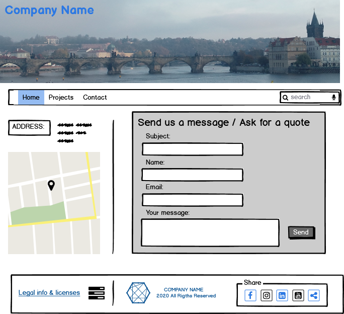
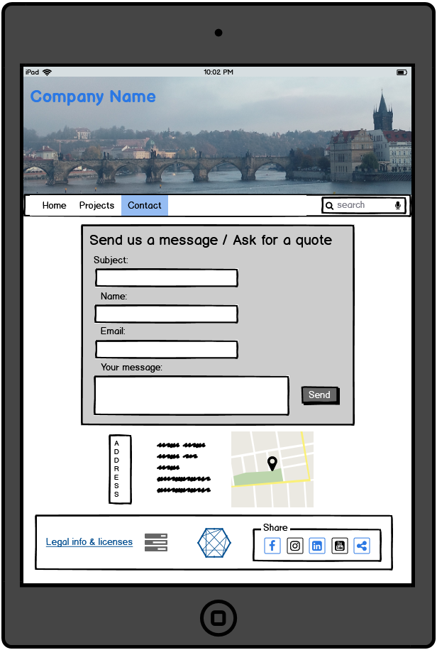

# User Centric Frontend
User Centric Frontend Development, Milestone Project 1

A simple 3-page website for a small business (offerings serfices of aerail phtography and filming), aimed at presenting the company, its services, experience/projects, equeipment, as well as provide a way for potential customers to contact the company.

## Wireframes
Balsamiq was used to create wireframes for this proejct.
PDF and BMPR files are stored at /assets/wireframes.

## UX

## Features
In this section, you should go over the different parts of your project, and describe each in a sentence or so.

Existing Features
Feature 1 - allows users X to achieve Y, by having them fill out Z

## Technologies Used
HTML5,
CSS3,
Bootstrap

## Testing

## Deployment

## Credits

#### Content
The text for section Y was copied from the Wikipedia article Z
#### Media
All the photos used for the website were taken by me, Alexey Statsenko
#### Acknowledgements

1. Idea about the central part of the website 1/3 & 2/3 taken from the "First CV" tutorial of the course. 
